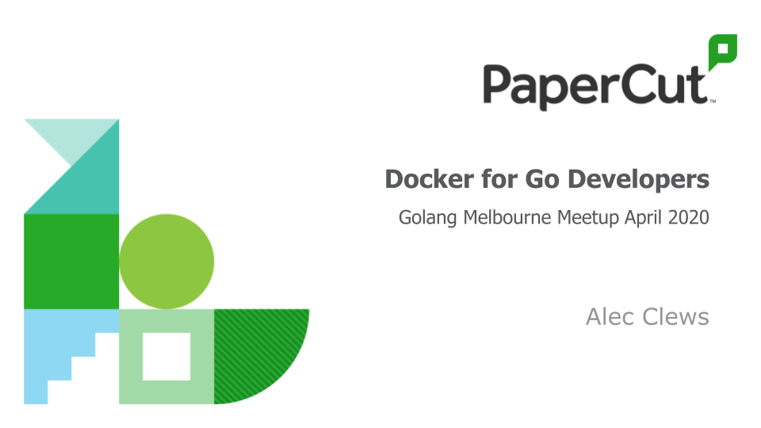

# Docker for Go Developers

A talk given at Gopher Melbourne (AU) in April 2020

For illustrative purposes.
this talk uses Go code adapted from
https://github.com/HakaseLabs/source-blog/blob/master/rest-api/main.go
